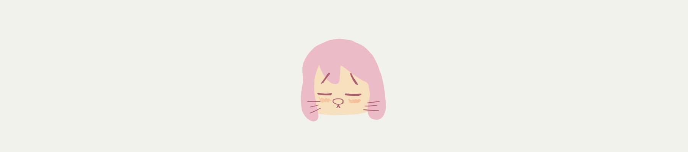

<h1 align="center"> <a href="#english">english</a> |<a href="#japanese">日本語</a></h1>


#  jumang potaru

- this a generic portfolio website using react.js
- [URL](https://jumang-potaru.dev)

<h1 align="left" id="english"> 🇺🇸english<h1>

# technologies

## SPA + SSG + Headless CMS + PWA + JamStack

- Framework => [Gatsby](https://https://www.gatsbyjs.com/)
- Main Language => [TypeScript](https://www.typescriptlang.org/)
- CSS => SCSS
- Server =>  [Google Firebase Hosting](https://firebase.google.com/)
- CMS =>  [microCMS](https://microcms.io/) 
- Library => [React.js](https://https://reactjs.org/)


# functions
## /pages
 
- introduction(/)     - about me, what i do or like

- projects(/projects) - what i did, like deployed webpages, some funny github repos

- info(/info)         - about this jumang-potaru site

- backwash(/backwash)    - some thoughts, computer or musical tips at jumang markdown previewer

## how it works

- Header
    - JUMANG POTARU logo to go main page quick
    - 3 buttons right(projects, about, library) to go each pages
    - fluffy motions each
- Footer
    - slimy box that click & dragable contains markdown contents

# how to develop locally
```
# clone
git clone <this html clone key>
# install dependancies
npm install
# serve with hot reload
gatsby develop 
```

# how to build locally
```
# build all tsx then put built file into /public
gatsby build
# serve /public
gatsby serve
```

<h1 align="left" id="japanese"> 🇯🇵日本語<h1>

# 技術

## SPA + SSG + Headless CMS + PWA + JamStack

- Framework => [Gatsby](https://https://www.gatsbyjs.com/)
- Main Language => [TypeScript](https://www.typescriptlang.org/)
- CSS => SCSS
- Server =>  [Google Firebase Hosting](https://firebase.google.com/)
- CMS =>  [microCMS](https://microcms.io/) 
- Library => [React.js](https://https://reactjs.org/)


# 関数
## /ページたち
 
- introduction(/)     - ジュマンについて。何をやったか何が好きか

- projects(/projects) - やったこととか、ページとか変なツールとか

- info(/info)         - このサイトについて

- backwash(/backwash)    - 考えたこととか、記事とか

## どんな感じ

- ヘッダー
    - ヘッダーロゴをおして、どこからでもすぐにメインページ
    - 右上のボタンから、ページに移動
    - ふわふわな動きがいっぱい
- フッター
    - ぽにょぽにょしてる四角

# 開発に参加したい？
```
# クローン
git clone <this html clone key>
# 依存パッケージのインストール
npm install
# ホットリロード付きの開発
gatsby develop 
```

# ビルド方法
```
# ビルドして/publicに配置
gatsby build
# ビルドしたファイルをローカルで立ち上げる
gatsby serve
```